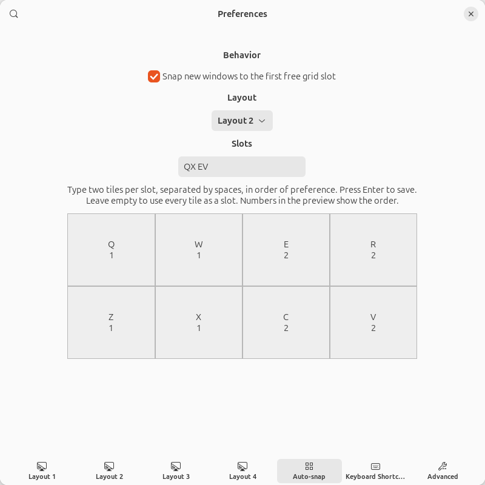
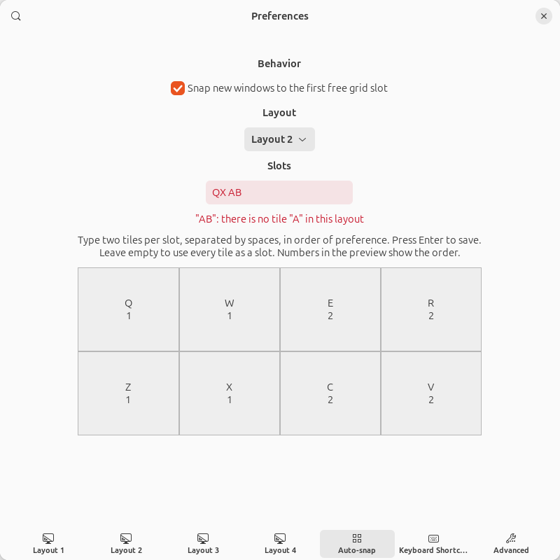

# tactile-snap

tactile-snap is a fork of [Tactile](https://gitlab.com/lundal/tactile) that adds auto-snap.
It can be installed alongside the original.

## Auto-snap

1. New windows snap to the first free slot of the grid.
2. If every slot is occupied, the window goes to the first slot.
3. A window moved to another workspace snaps again there.
   Example: a window on the right of workspace 1 is moved to the empty workspace 2 and snaps to the left.
4. Slots are configurable and can span several cells, e.g. a 4x2 grid with the slots "left half" and "right half".
   Without configuration, every visible cell is a slot.
5. Auto-snap is off by default. Turn it on in Preferences → Auto-snap.

Disable the original Tactile before enabling tactile-snap, because both use `Super+T`.

### Configuring slots

Configure auto-snap in Preferences → Auto-snap:

- Choose the layout auto-snap uses (layout 1 by default).
- Type the slots as pairs of tiles, in order of preference, and press Enter.
  A pair spans a slot from the first tile to the second, as when typing tiles after `Super+T`.
  Example for a 4x2 grid with the default tiles: `QS EF` gives a left and a right half.
- Leave the field empty to use every visible cell as a slot.

The preview shows the tiles of the chosen layout. The numbers show the order in which free slots are used.



If a pair does not match two visible tiles of the chosen layout, the field turns red and nothing is saved.



The settings can also be changed with `gsettings`. Slots are stored as a list of `(col, row, cols, rows)`:

```sh
gsettings --schemadir ~/.local/share/gnome-shell/extensions/tactile-snap@alexanderzeitler.com/schemas \
  set org.gnome.shell.extensions.tactile-snap auto-snap-slots "[(0,0,2,2),(2,0,2,2)]"
```

The layout is stored in `auto-snap-layout` (1 to 4):

```sh
gsettings --schemadir ~/.local/share/gnome-shell/extensions/tactile-snap@alexanderzeitler.com/schemas \
  set org.gnome.shell.extensions.tactile-snap auto-snap-layout 2
```

### Taking over existing Tactile settings

```sh
dconf dump /org/gnome/shell/extensions/tactile/ | dconf load /org/gnome/shell/extensions/tactile-snap/
```

### Known limitations

- Apps that restore their own window geometry after the first frame (e.g. Firefox, Electron apps) can occasionally override the snap.

# Tactile

A window tiling extension for GNOME Shell.

> Tile windows on a custom grid using your keyboard. Type Super-T to show the grid,
> then type two tiles (or the same tile twice) to move the active window.
>
> The grid can be up to 4x3 (corresponding to one hand on the keyboard)
> and each row/column can be weighted to take up more or less space.

https://extensions.gnome.org/extension/4548/tactile/

## Examples


## Common issues

- **The window extends to the right and/or bottom of the selected tile(s)**

  Most likely, the window's minimum width or height is larger than the target tile(s).
  If so, there is nothing Tactile can do. Parts of the window will overflow to the right and/or bottom.
  You can test this with LibreOffice Writer, which has no minimum size.

- **The window resizes but does not move, or moves but does not resize**

  New versions of GNOME tend to introduce bugs in the window handling on Wayland.
  These are normally fixed after a couple of weeks. Check if the issue disappears on Xorg.
  If so, it likely can't be fixed in Tactile, but please file an issue to let me know.

- **Tactile fails to start after an update and shows 'Error'**

  There seems to be a bug in GNOME's extension updater that can corrupt the extension when multiple versions are released in a short time span.
  Try to uninstall Tactile (delete `~/.local/share/gnome-shell/extensions/tactile@lundal.io/`), reboot your machine, and then install it again.
  If the issue persists, please file an issue.

## License

Tactile is distributed under the terms of the GNU General Public License v3.0 or later.
See the [license](LICENSE) file for details.
